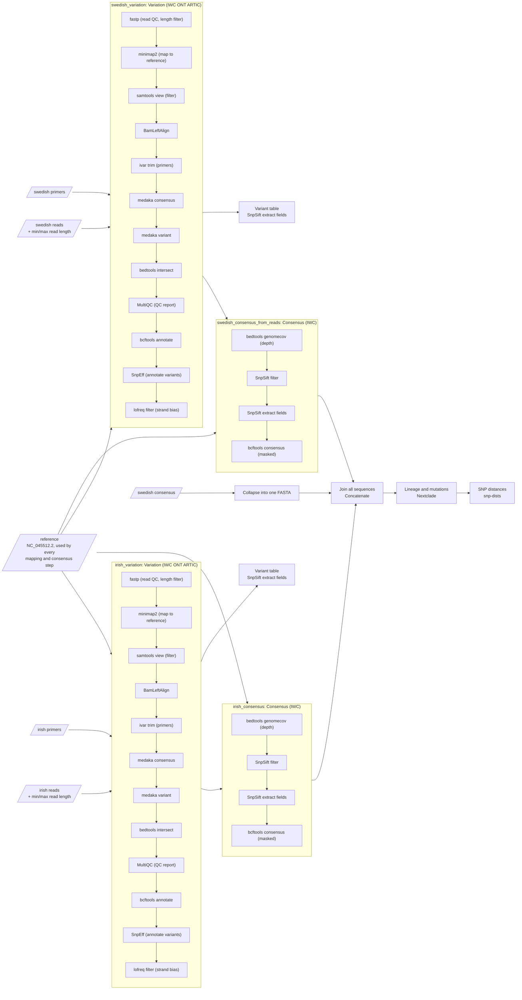

# GenViData workflow graph

Made by `scripts/make_workflow_dag.py` from `workflow/genvidata.ga`. The picture version is `genvidata_dag.png`.

```mermaid
graph LR
    n0[/"reference<br/>NC_045512.2, used by every<br/>mapping and consensus step"/]
    n1[/"irish reads<br/>+ min/max read length"/]
    n2[/"irish primers"/]
    n5[/"swedish reads<br/>+ min/max read length"/]
    n6[/"swedish primers"/]
    n9[/"swedish consensus"/]
    subgraph s10["irish_variation: Variation (IWC ONT ARTIC)"]
        s10_0["fastp (read QC, length filter)"]
        s10_1["minimap2 (map to reference)"]
        s10_0 --> s10_1
        s10_2["samtools view (filter)"]
        s10_1 --> s10_2
        s10_3["BamLeftAlign"]
        s10_2 --> s10_3
        s10_4["ivar trim (primers)"]
        s10_3 --> s10_4
        s10_5["medaka consensus"]
        s10_4 --> s10_5
        s10_6["medaka variant"]
        s10_5 --> s10_6
        s10_7["bedtools intersect"]
        s10_6 --> s10_7
        s10_8["MultiQC (QC report)"]
        s10_7 --> s10_8
        s10_9["bcftools annotate"]
        s10_8 --> s10_9
        s10_10["SnpEff (annotate variants)"]
        s10_9 --> s10_10
        s10_11["lofreq filter (strand bias)"]
        s10_10 --> s10_11
    end
    subgraph s11["irish_consensus: Consensus (IWC)"]
        s11_0["bedtools genomecov (depth)"]
        s11_1["SnpSift filter"]
        s11_0 --> s11_1
        s11_2["SnpSift extract fields"]
        s11_1 --> s11_2
        s11_3["bcftools consensus (masked)"]
        s11_2 --> s11_3
    end
    n12["Variant table<br/>SnpSift extract fields"]
    subgraph s13["swedish_variation: Variation (IWC ONT ARTIC)"]
        s13_0["fastp (read QC, length filter)"]
        s13_1["minimap2 (map to reference)"]
        s13_0 --> s13_1
        s13_2["samtools view (filter)"]
        s13_1 --> s13_2
        s13_3["BamLeftAlign"]
        s13_2 --> s13_3
        s13_4["ivar trim (primers)"]
        s13_3 --> s13_4
        s13_5["medaka consensus"]
        s13_4 --> s13_5
        s13_6["medaka variant"]
        s13_5 --> s13_6
        s13_7["bedtools intersect"]
        s13_6 --> s13_7
        s13_8["MultiQC (QC report)"]
        s13_7 --> s13_8
        s13_9["bcftools annotate"]
        s13_8 --> s13_9
        s13_10["SnpEff (annotate variants)"]
        s13_9 --> s13_10
        s13_11["lofreq filter (strand bias)"]
        s13_10 --> s13_11
    end
    subgraph s14["swedish_consensus_from_reads: Consensus (IWC)"]
        s14_0["bedtools genomecov (depth)"]
        s14_1["SnpSift filter"]
        s14_0 --> s14_1
        s14_2["SnpSift extract fields"]
        s14_1 --> s14_2
        s14_3["bcftools consensus (masked)"]
        s14_2 --> s14_3
    end
    n15["Variant table<br/>SnpSift extract fields"]
    n16["Collapse into one FASTA"]
    n17["Join all sequences<br/>Concatenate"]
    n18["Lineage and mutations<br/>Nextclade"]
    n19["SNP distances<br/>snp-dists"]
    n0 --> s10
    n1 --> s10
    n2 --> s10
    n0 --> s11
    s10 --> s11
    s10 --> n12
    n0 --> s13
    n5 --> s13
    n6 --> s13
    n0 --> s14
    s13 --> s14
    s13 --> n15
    n9 --> n16
    s11 --> n17
    s14 --> n17
    n16 --> n17
    n17 --> n18
    n18 --> n19
```
